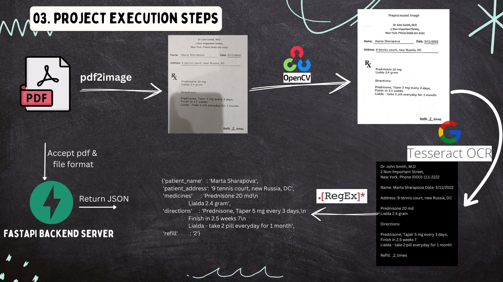
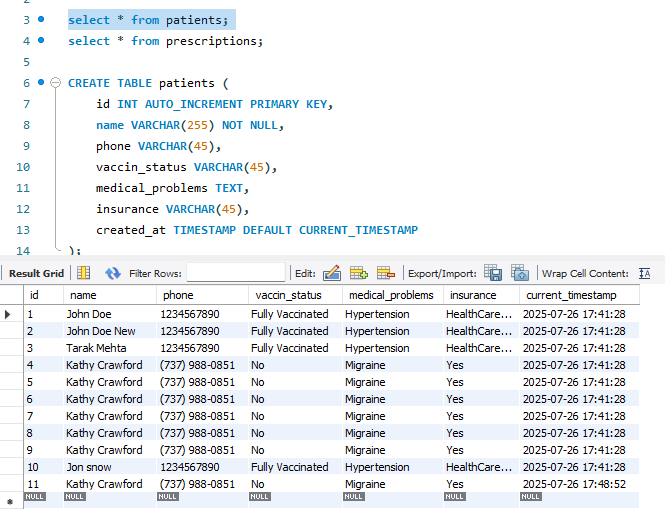
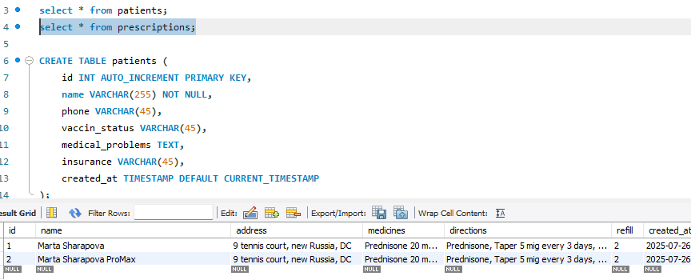

# Medical Data Extraction


## Demo

https://github.com/user-attachments/assets/b82f780a-60c4-449a-b501-fa27f7136990


## <a name="a2">1. Introduction </a>

> Whenever we go to hospital, we always fill up some kind of forms and our medical history is created using those forms, prescriptions, test reports. Sometimes, this medical history is used for other purposes like claiming health insurance etc

> Health Insurance company might receive thousands of such documents from multiple sources and creating a record of useful information from customers medical history is a very cumbersome task and requires huge manpower. And hence this kind of tasks can be sped up using OCR technology.

For this project we have two types of Medical Documents.

1. Patient Medical Record
2. Prescription

We are going to extract some important fields from these documents.


## 2 Why this project?

Though I have been learning Data Science, then why am I doing this project? Mainly there are 3 reasons. 01. OCR is a subset of Computer Vision. OCR can be used in an NLP project like summarizing text using LLM. 02. This project involves very fundamental concepts of Python programming like OOP and Modular programming which are industry best practices. 03. Also this project involves creation of a backend server using FastAPI, which is known for its performance and many world-renowned companies such as Uber, Netflix and Microsoft use FastAPI to build their applications.

## <a name="a3">3. Project Execution Steps</a>

- **Step 1:** Convert pdf to image using `pdf2image` library
- **Step 2:** Preprocess the image (Apply `adaptive thresholding and binarization using OpenCV2`)
- **Step 3:** Extracting text from image by passing it through `tesseract OCR engine`
- **Step 4:** Finding useful information from text using `RegEx` and returning in JSON format
- **Step 5:** Creating a `FastAPI backend server` which serves data extraction requests by accepting a pdf_file, file_format and returning a JSON object.
- **Step 6:** To create a Demo of `frontend UI using Streamlit` and connect it with our FastAPI server using Python Requests module.
  

## <a name="a4">4. Code Walkthrough</a>

Explore notebooks and source code of this project.

- Notebook 1: [Prescription_parser](https://github.com/abhijeetk597/medical-data-extraction/blob/main/Notebooks/01_prescription_parser.ipynb)
- Notebook 2: [Patient_details_parser](https://github.com/abhijeetk597/medical-data-extraction/blob/main/Notebooks/02_patient_details_parser.ipynb)
- Backend: [Source code directory](https://github.com/abhijeetk597/medical-data-extraction/tree/main/backend/src)
- Frontend: [Streamlit app](https://github.com/abhijeetk597/medical-data-extraction/blob/main/frontend/app.py)

## <a name="a5">5. What did I learn through this project?</a>

- How to use OCR for real world projects and key image processing concepts like thresholding using `OpenCV2`.
- Polished up my Python coding skills by using `OOP, code refactoring and modular programming`.
- Setting up of a backend server using `FastAPI` framework.
- Unit testing using `Pytest`.
- How to use `Postman` for API testing.
- I could connect Streamlit frontend with FastAPI backend server using `Python requests` module.

## <a name="a6">6. Challenges faced during this project</a>

- In adapative thresholding, it requires lot of trial and error to reach optimum values of block size and constant.
- Pytest is not properly integrated with VSCode.
- Also I faced path related errors during unit testing even in PyCharm.
- When creating streamlit app, there are very few practical instructions available on internet for connecting it with a backend server and sending files across.

## <a name="a7">7. Directory Structure of Project</a>

```
medical-data-extraction
│   .gitignore
│   README.md
│   requirements.txt
│
├───backend
│   │
│   ├───resources
│   │   │
│   │   ├───patient_details
│   │   │       pd_1.pdf
│   │   │       pd_2.pdf
│   │   │
│   │   └───prescription
│   │           pre_1.pdf
│   │           pre_2.pdf
│   │
│   ├───src
│   │       extractor.py
│   │       main.py              //Fastapi Backend Server
│   │       parser_generic.py
│   │       parser_patient_details.py
│   │       parser_prescription.py
│   │       utils.py
│   │
│   ├───mysql_scripts
│   │       queries.sql
│   │
│   ├───tests
│   │       test_prescription_parser.py
│   │
│   └───uploads
│
├───frontend
│       app.py              //Streamlit app
│
├───Notebooks
│       01_prescription_parser.ipynb
│       02_patient_details_parser.ipynb
│       03_RegEx.ipynb
│
└───reference
        tesseract_papar_by_google.pdf
```

## <a name="a8">8. If you are cloning this repository?</a>

- Install all dependancies from `requirements.txt`
- For `pdf2image` you need to [download `poppler`](https://github.com/belval/pdf2image?tab=readme-ov-file#how-to-install)
- Install Tesseract OCR Engine in your PC
  - [Tesseract installation instrution : Github](https://github.com/tesseract-ocr/tesseract#installing-tesseract)
  - [Tesseract windows specific instructions: Github](https://github.com/UB-Mannheim/tesseract/wiki)
- Set required PATHs as per your environment
  > [Demo video to clone and run this project in your machine.](https://youtu.be/UWmOePHzePM)
- Update: Now you will have to link you db for storing data. Python code updated accordingly, and script for creation of db table and SPs is uploaded in the repo.

## <a name="a9">9. 🚀 Update 1: Store data into MySQL DB after verification in UI</a>

- In the Streamlit UI I have kept a submit button but there was no any event listener for the button. Now I have integrated DB functionality and you can store the data on UI back into MySQL Database using Stored Procedures.
- In the directory `mysql_scripts`, you can find queries used for creation of table and stored procedures. In the `backend\scr` directory a new module `db_utils` added, where you can find code for how you can connect your database with python. In the `main.py` 2 new POST methods created for updating the db tables.

> In the UI, once you receive OCR output, you can modify it before saving to db.



